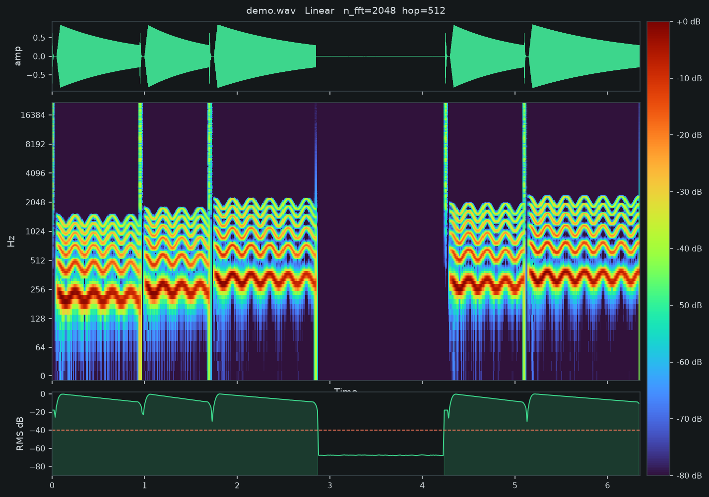
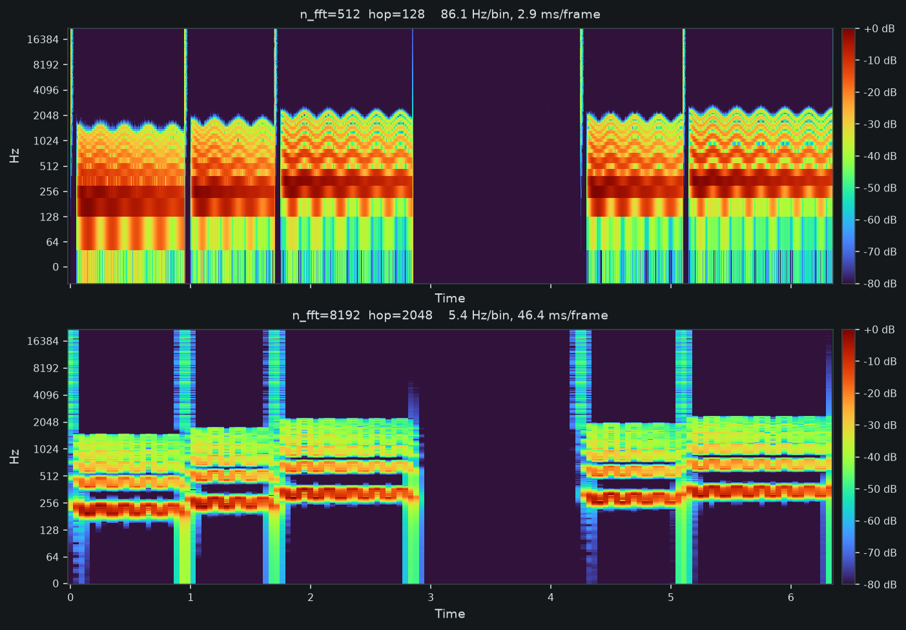
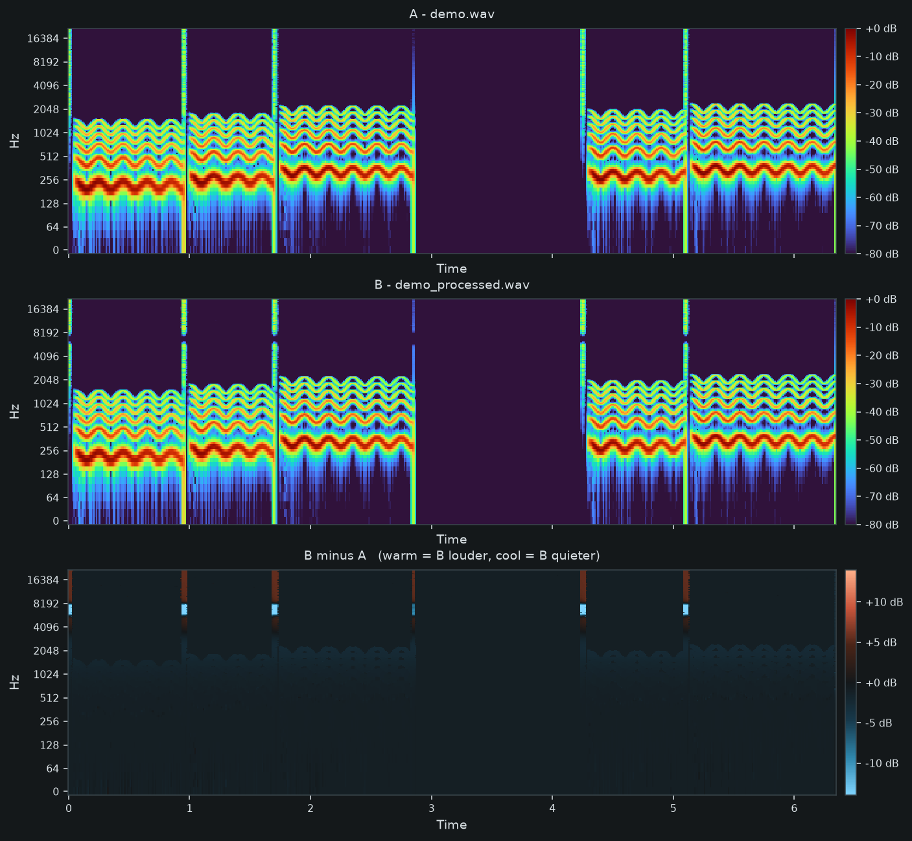
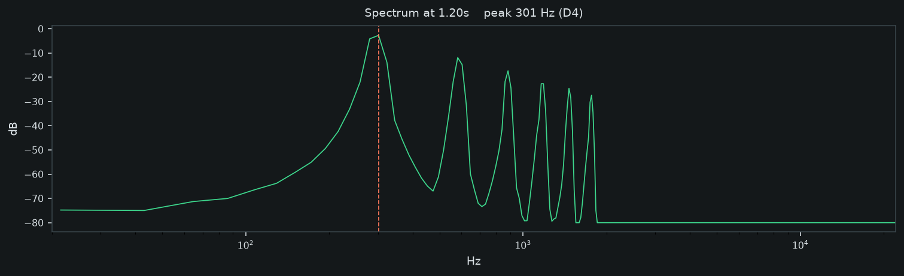
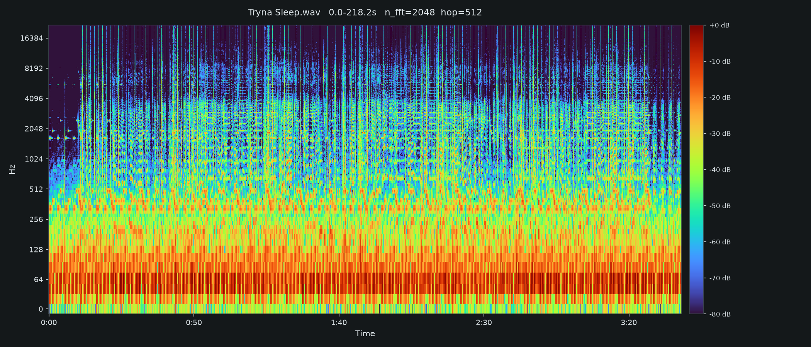

# Spectrogram Reader

A tool for **seeing what audio processing actually does** — to your signal, and to
your analysis.

Every spectrogram is a lie of a particular shape. Widen the analysis window and
pitch snaps into focus while transients smear; narrow it and you get the opposite.
Most tools hide that choice behind a preset. This one puts it on a slider, tells
you the resolution you bought with it, and then lets you point the same machinery
at a second file to see exactly what a plugin, a filter, or a bounce changed.



## Why this exists

I built it because I wanted to understand what the knobs meant. I had used
spectrograms for years in a DAW without being able to say what `n_fft` did beyond
"bigger is smoother," and reading about the time-frequency tradeoff never stuck
the way watching it move does.

Somewhere in the building it turned into something more useful than a study aid.
Once you can see a spectrogram properly, the obvious next question is *what did
that de-esser do* — and answering it needs two spectrograms on one shared scale,
plus their signed difference. That turned out to be the part no free tool does
casually, and it's now the reason to use this.

## Who it's for

- **Producers and mix engineers** who want to see a plugin's effect rather than
  infer it from A/B listening. The Compare page is built for exactly this.
- **Audio ML people** who need to eyeball features before training and want the
  matrix out as `.npy` with the parameters that produced it.
- **Anyone learning DSP.** The live resolution readout teaches the tradeoff
  faster than a static textbook figure.

### What it isn't

Not a metering suite, not a mastering tool, not a replacement for your ears. It's
a magnifying glass. It will not tell you whether a change was good.

## The tradeoff, in one picture

Same audio, same dynamic range, only the window changed.



At `n_fft=512` every transient is a hard vertical edge and the harmonics are
smeared into mush. At `n_fft=8192` the harmonic stack resolves into clean bands
you can trace, and the onsets blur. Neither is more correct — they are different
instruments, and the top-right readout tells you which one you're holding.

This is not a software limitation. Time and frequency resolution trade against
each other as a property of the transform itself, and no setting escapes it.

## Quick start

```bash
pip install librosa soundfile matplotlib numpy scipy streamlit
python -m streamlit run app.py
```

Open http://localhost:8502. Upload a file. The sidebar is the instrument.

There's also a CLI for one-off renders and batch work:

```bash
python spectro.py vocal.wav                    # PNG next to the input
python spectro.py vocal.wav --mel              # mel scale
python spectro.py vocal.wav -n 512  -H 128     # transient detail
python spectro.py vocal.wav -n 8192 -H 2048    # pitch detail
python spectro.py vocal.wav --db 40 -o out.png # tighter dynamic range
```

It prints the resolution you actually got:

```
vocal.wav: 44100 Hz, 218.2s
matrix: 1025 bins x 18793 frames
freq resolution: 21.5 Hz/bin
time resolution: 11.6 ms/frame
```

## Compare — the part worth having



Load the original into **A** and the processed version into **B**. Both are
analyzed with identical parameters against **one shared dB reference**, then the
third panel shows `B − A` in signed decibels.

The shared reference is the whole trick. `librosa` normalizes dB to each file's
own peak by default, so two independently-rendered spectrograms silently hide any
level difference between them — a track 3 dB quieter looks identical. Comparing
those is meaningless. Here both files are measured against
`max(peak_A, peak_B)`, so a 3 dB difference reads as 3 dB.

In the figure above, B had an air boost and a 5.5–8.5 kHz cut applied. You can
read both off the difference panel directly: cyan bars where energy was removed,
warm streaks above 8 kHz where it was added, and near-black everywhere nothing
happened.

Point it at a real de-esser and the sibilants light up cool with everything else
neutral. Point it at a compressor and the quiet passages go warm. It makes plugin
behaviour legible in a way that switching bypass on and off does not.

Alongside it you get the numbers: mean change, largest boost, largest cut, and the
percentage of bins that moved more than 1 dB — a decent "did this actually do
anything" check.

### The `diffdark` colormap

Every diverging colormap matplotlib ships puts **white** at zero. Since most of a
difference is near zero, that floods the panel with white and buries the signal.
`diffdark` is a custom diverging map with a **dark** midpoint matching the app
background, so "nothing changed" recedes and real changes glow. The standard maps
(`RdBu_r`, `coolwarm`, `PuOr_r`, and others) are still in the dropdown.

## Every knob, and what it actually does

**Seconds** — which slice of the file to analyze. Narrowing it makes everything
below faster and more legible. On a four-minute file viewed whole, each pixel
column is roughly a tenth of a second.

**Window (`n_fft`)** — how many samples the FFT sees per slice. This is the core
tradeoff described above. Wide resolves pitch, narrow resolves timing.

**Overlap** — how far the window slides between slices, as a fraction of its
length. 75% means each slice shares three quarters of its samples with the last.
More overlap gives smoother-looking time detail without touching frequency
resolution — it samples the same analysis more finely rather than adding
information, and costs proportionally more frames.

**Scale** —
- *Linear*: raw STFT bins, plotted on a log frequency axis.
- *Mel*: frequency remapped to match human pitch perception — fine resolution low,
  coarse high. A linear spectrogram gives 10–11 kHz as much screen space as
  100–1100 Hz, which is backwards for voice. Mel is what most audio models eat.
- *MFCC*: the DCT of the log-mel spectrogram. No longer a picture of the sound —
  a compressed description of its spectral envelope. Flip between Mel and MFCC on
  the same phrase to see what the DCT discards. Units are not decibels here, and
  the colorbar changes accordingly.

**Mel bands / MFCC count** — resolution of those two representations. 128 mel bands
and 20 coefficients are the common defaults.

**High-pass filter** — a zero-phase Butterworth. *Zero-phase matters*: it's run
forwards and backwards (`sosfiltfilt`), so nothing shifts in time. An ordinary
filter would smear onsets and make the waveform strip lie about when things
happen. Useful for confirming whether low-end energy is signal or rumble — the log
frequency axis gives the bottom octave a lot of real estate and tends to oversell
it. Check the RMS before and after; it often barely moves.

**Waveform** — amplitude envelope, x-axis locked to the spectrogram. Phrase
boundaries are far easier to spot here than in the spectrogram.

**Energy curve** — RMS in dB with an adjustable silence threshold, shading
everything above it, and reporting what percentage of frames are active. If you're
building a labeled dataset, this is your class balance, measured, with a knob for
where the boundary sits. Move the threshold and watch the percentage swing — that
sensitivity is worth knowing before you commit to a labeling scheme.

**Dynamic range** — everything is plotted relative to the loudest point. At 80 dB
you see reverb tails and room tone; at 40 dB only the strong content survives,
which makes structure pop.

**Probe** — drops a cursor on every panel and plots the spectrum at that instant,
marking the loudest bin and naming the nearest note.



## Exports

Every view exports at full resolution — never the decimated display copy.

| File | Contents |
|---|---|
| `*_stft_n2048_h512.png` | The rendered figure |
| `*_stft_n2048_h512.npy` | The dB matrix for the current segment |
| `*_minus_*.npy` | The signed difference matrix |
| `*_vs_*.npz` | `A`, `B`, `sr`, `n_fft`, `hop` together |

Filenames encode scale, window, hop and time range, so
`vocal_A_stft_n2048_h512_18-30s.png` tells you exactly what produced it.

```python
import numpy as np
D = np.load("vocal_stft_n2048_h512.npy")      # (bins, frames) in dB

pair = np.load("a_vs_b_stft_n2048_h512.npz")
pair["A"], pair["B"], int(pair["sr"])         # both matrices plus parameters
```

The `.npz` is the one to keep for analysis — the pair and the parameters that made
them, so the work is reproducible from the file alone.

## Layout

```
app.py              single-file view (waveform, spectrogram, energy, probe)
pages/2_Compare.py  A/B compare with shared-reference difference
core.py             shared helpers, theme, diffdark colormap
spectro.py          CLI renderer
make_figures.py     regenerates the demo audio and every README image
docs/               generated figures and synthetic demo audio
.streamlit/         theme
```

Every figure in this README is generated by `python make_figures.py` from
synthetic audio built in that script — so the repo ships no large audio files and
the figures can be regenerated from scratch.

The tool was developed and tested against stems from my own records. The figure
below is the isolated lead vocal from **"Wanna Sleep"** — a real render from this
app, not synthetic. The song and the rest of the catalogue are on
[Spotify](https://open.spotify.com/artist/6q3Ld18OFCXzbAf23ON096).



Writing and mixing this material is a large part of why I wanted to see it
properly. Note the long silent stretches — an isolated backing or lead vocal is
mostly *not singing*, which is obvious in hindsight and invisible until you plot
it.

## Performance notes

Display is capped at 2000 time columns. Past that, matplotlib is drawing more
columns than the screen has pixels — it buys nothing and costs a great deal. A
four-minute file at `hop=512` produces about 19,000 frames; rendering all of them
takes roughly seven seconds versus well under one when thinned. The **Drawn**
metric tells you when thinning is active, and narrowing the segment returns you to
every frame. Exports and `.npy` are always full resolution regardless.

Decoded audio is cached per file, so moving a slider re-runs only the STFT
(~0.3 s), not the decode (~3 s).

## Known bugs and rough edges

**Unicode note names crash a Windows console.** `librosa.hz_to_note()` returns a
real musical sharp (♯, U+266F). It renders fine in the browser, but printing it
from a `cp1252` terminal raises `UnicodeEncodeError`. The figure script passes
`unicode=False` to get `F#0` instead; if you reuse the probe code in a CLI, do the
same or set `PYTHONIOENCODING=utf-8`.

**The difference matrix is computed twice** on the Compare page — once for the
display and once for the summary metrics. Harmless at these sizes, and left alone
rather than adding caching for no measurable gain.

**`analyze()` in the main app is not cached.** Every slider change recomputes the
STFT. Measured at about 0.3 s, so caching would add complexity for no perceptible
benefit. If you point this at very long files it's the first thing to change.

### Limitations worth naming

- Mono only. Stereo files are downmixed on load; there's no mid/side or per-channel view.
- Compare resamples B to A's rate and trims both to the shorter file, warning if
  they differ by more than 2%. It does **not** time-align them — if your processed
  version has latency, the difference will be wrong in a way that looks real.
  Bounce with delay compensation.
- The probe reads the nearest STFT frame, not an interpolated instant.
- `turbo` is the default because it reveals the most detail, but it is **not**
  perceptually uniform — equal colour steps do not mean equal dB steps. Use
  `cividis` or `viridis` for anything going in front of reviewers.

## Ideas not yet built

- Pitch track overlaid on the spectrogram
- Per-channel and mid/side views
- Batch CLI export over a folder
- Hover readout (would need a plotly backend; matplotlib figures are static here)

## Built with

[librosa](https://librosa.org) · [Streamlit](https://streamlit.io) ·
[matplotlib](https://matplotlib.org) · [SciPy](https://scipy.org) ·
[soundfile](https://python-soundfile.readthedocs.io)
